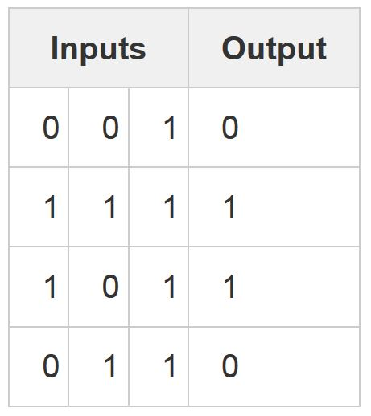

# Project description

A neural network trained with backpropagation is attempting to use input to predict output.

Consider trying to predict the output column given the three input columns. 

We could solve this problem by simply measuring statistics between the input values and the output values. If we did so, we would see that the leftmost input column is perfectly correlated with the output. Backpropagation, in its simplest form, measures statistics like this to make a model. Let's jump right in and use it to do this.